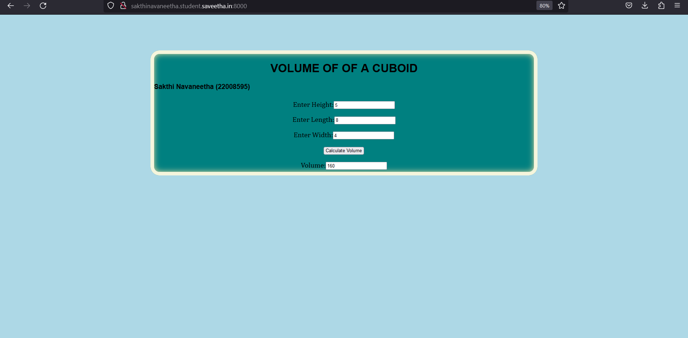

# Design a Website for Server Side Processing

## AIM:
To design a website to perform mathematical calculations in server side.

## DESIGN STEPS:

### Step 1:

First clone the repository in open theia ide terminal.

### Step 2:

Write the program using html and css for the calculations to be displayed in the server side.

### Step 3:

make the allowed hosts '*' in setting.py in order to run our webserver.

### Step 4:

add codes to urls.py, views.py to run the code into the server.

### Step 5:

Now give python3 manage.py runserver 0:8000 to make the server run.

### Step 6:

Publish the website in the given URL.

## PROGRAM :
```

math.html 
<!DOCTYPE html>
<html>
<head>
    <meta charset='utf-8'>
    <meta http-equiv='X-UA-Compatible' content='IE=edge'>
    <title>Volume Calculator</title>
    <meta name='viewport' content='width=device-width, initial-scale=1'>
    
</head>
<style>
    *{
        box-sizing: border-box;
        font-family: Arial, Helvetica, sans-serif;
    }

    body{
    background-color: lightblue;
    color:black;
    }

    .container{
    width: 1080px;
    height: 350px;
    margin-top: 100px;
    margin-left: auto;
    margin-right: auto;
    border-radius: 25px;
    border: 10px solid beige;
    box-shadow: inset 0 0 15px rgb(231, 217, 160);
    background-color:teal;
    }
    h1{
        color: rgb(0, 0, 0);
        text-align: center;
    }
    .calculate{
        padding-top: 10px;
        padding-bottom: 10px;
        padding-left: 10px;
        padding-right:10px;
        text-align: center;
        font-size: 20px;
        padding-top: 7px;
        font-family: Cambria, Cochin, Georgia, Times, 'Times New Roman', serif;
    }
</style>
<body>
    <div class="container">
        <h1>VOLUME OF OF A CUBOID</h1>
        <h3 align="centre"> Sakthi Navaneetha (22008595)</h3>
        <form method="POST">
            
            <div class="calculate"> 
                Enter Height:<input type="text" name="height" value={{h}}></input><br/>
            </div>
            <div class="calculate">
                Enter Length:<input type="text" name="length" value={{l}}></input><br/>
            </div>
            <div class="calculate">
                Enter Width:<input type="text" name="width" value={{w}}></input><br/>
            </div>
            <div class="calculate">
                <input type="submit" value="Calculate Volume"></input><br/>
            </div>
            <div class="calculate">
                Volume:<input type="text" name="volume" value={{volume}}></input>
            </div>
        </form>
    </div>
</body>
</html>
 

 views.py
 from django.shortcuts import render

def volumecalculation(request):
    context ={}
    context["volume"]='0'
    context["h"]='0'
    context["l"]='0'
    context["w"]='0'
    if request.method == 'POST':
    
        h=request.POST.get('height','0')
        l=request.POST.get('length','0')
        w=request.POST.get('width','0')
        volume=int(h)*int(l)*int(w)
        context['volume'] = volume
        context['l']=l
        context['h']=h
        context['w']=w
    return render(request,"myapp/math.html",context)

    urls.py
    from django.contrib import admin
from django.urls import path
from myapp import views

urlpatterns=[
    path('admin/',admin.site.urls),
    path('volofrectangulartank/',views.volumecalculation,name="volofrectangulartank"),
    path('',views.volumecalculation,name="volofrectangulartankroot")
]
```
## OUTPUT:




## Result:
The program for implementing server side processing is completed succesfully .
